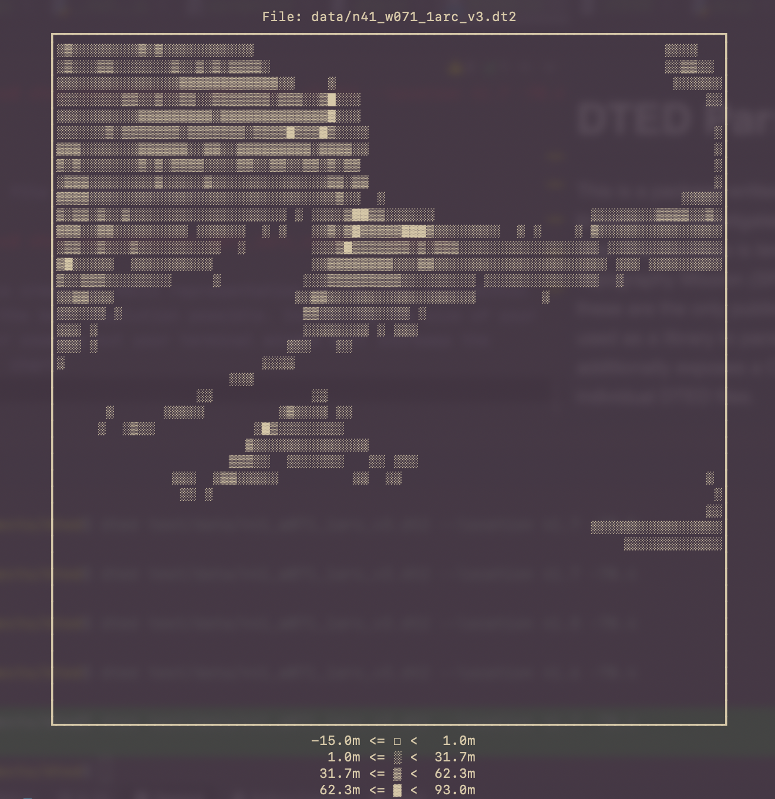
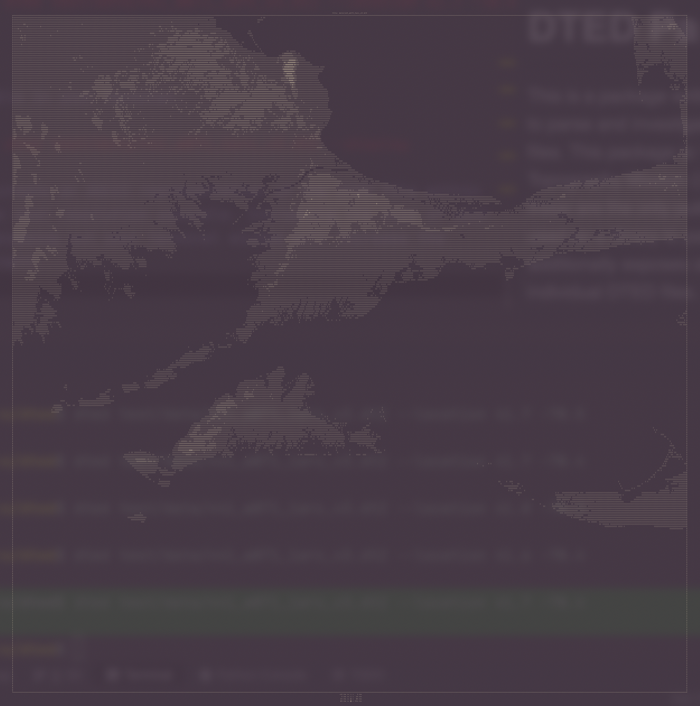

# DTED Parser

This is a package written in pure python (with help from `numpy`) to parse
  and investigate Digital Terrain Elevation Data (DTED) files. This package
  is tested to work on Shuttle Radar Topography Mission (SRTM) DTED files
  (as far as I can tell these are the only publicly available DTED files).
  This can be used as a library to parse these files into `numpy` arrays
  and additionally exposes a CLI that can be used to investigate individual
  DTED files.
  
For more information and resources about the DTED file format see the
  end of the README.  

## How to install
You can install this as a normal python package using `pip`
```bash
pip install dted
``` 

## How to use

The following example code will parse DTED file checked into this repository
  for testing.

### As a library

Parsing a DTED file into a numpy array is as simple as:
```python
import numpy as np
from pathlib import Path
from dted import Tile

dted_file = Path("test/data/n41_w071_1arc_v3.dt2")
tile = Tile(dted_file)
assert isinstance(tile.data, np.ndarray)
```

Additionally, you can access the metadata of the DTED file (the User Header 
  Label, Data Set Identification, and Accuracy Description records) easily.

```python
from pathlib import Path
from dted import Tile

dted_file = Path("test/data/n41_w071_1arc_v3.dt2")
tile = Tile(dted_file)
print(tile.dsi.south_west_corner)
```

Parsing entire DTED files has been heavily optimized, but does still take
  a little bit of time. On my machine (2014 MacbookPro) parsing the 25MB
  example file take about 120 ms. However, if you only need to look up
  specific terrain elevations within a DTED file you do not need to parse
  the entire file. Doing the following takes <1ms on my machine: 

```python
from pathlib import Path
from dted import LatLon, Tile

dted_file = Path("test/data/n41_w071_1arc_v3.dt2")
tile = Tile(dted_file, in_memory=False)
print(tile.get_elevation(LatLon(latitude=41.5, longitude=-70.5)))
```

If for some reason you _really_ need to eke out every bit of performance, and
  you thoroughly trust your DTED data, you speed up the data parsing by
  skipping the checksum verification. Doing the following takes about 75 ms
  on my machine:
  
```python
import numpy as np
from pathlib import Path
from dted import Tile

dted_file = Path("test/data/n41_w071_1arc_v3.dt2")
tile = Tile(dted_file, in_memory=False)
tile.load_data(perform_checksum=False)

assert isinstance(tile.data, np.ndarray)
```

The final functionality the `dted.Tile` class offers is to easily check if
  a coordinate location is contained within the DTED file. This also does
  not require that the DTED data is fully loaded into memory:

```python
from pathlib import Path
from dted import LatLon, Tile

dted_file = Path("test/data/n41_w071_1arc_v3.dt2")
tile = Tile(dted_file, in_memory=False)

assert LatLon(latitude=41.5, longitude=-70.25) in tile
```

## As a CLI

Installing this package into an activated virtual environment also exposes
  the `dted` terminal command. This provides three pieces of functionality:
1. See report of the metadata of the DTED file.
2. Lookup terrain elevation at a specific point within the DTED file.
3. Display and ASCII representation of the DTED file in your terminal.

To get a report of the file metadata:
```bash
(.venv) user@machine$ dted test/data/n41_w071_1arc_v3.dt2 
File Path:          test/data/n41_w071_1arc_v3.dt2 (24 MB)
Product Level:      DTED2
Security Code:      U
Compilation Date:   02/2000
Maintenance Date:   
Datums (V/H):       E96/WGS84

    (42.0N,71.0W)      (42.0N,70.0W)
          NW --------------- NE     
          |                   |     
          |                   |     
          |                   |     
          |                   |     
          |                   |     
          |                   |     
          SW --------------- SE     
    (41.0N,71.0W)      (41.0N,70.0W)

Origin:                 (41.0N,71.0W)
Resolution (lat/lon):   1.0"/1.0"
Accuracy (V/H):         6m/13m
```

To lookup terrain elevation at a specific point:
```bash
(.venv) user@machine$ dted test/data/n41_w071_1arc_v3.dt2 --location 41.7 -70.4
51.0 meters
```

To display the DTED file in your terminal:
```bash
(.venv) user@machine$ dted test/data/n41_w071_1arc_v3.dt2 --display
```
This will attempt to create an ASCII representation of the DTED file within
  your terminal at the best resolution possible. Increasing the size of your
  terminal window or zooming out your terminal window will increase the 
  resolution of the chart:
  




Why did I add this feature? Why not?

If you want to plot this data like a sane person, you can use the following
 example code with the `matplotlib` package (not included)

```python
import matplotlib.pyplot as plt
from pathlib import Path
from dted import Tile

dted_file = Path("test/data/n41_w071_1arc_v3.dt2")
tile = Tile(dted_file)
plt.imshow(tile.data.T[::-1], cmap="hot")
```

## The DTED file format

This parser was created using the specification provided here:
```
https://www.dlr.de/eoc/Portaldata/60/Resources/dokumente/7_sat_miss/SRTM-XSAR-DEM-DTED-1.1.pdf
```

Some things to be aware of with the DTED file format:
1. Some DTED files contain "void" values for data points where elevation
  data is not known (such as over bodies of water). An example of such a
  file can be found at `test/data/n00_e006_3arc_v2.dt1`. This package
  will emit a warning if void data is found, and the definition of the
  void value can be found in `dted.definitions.VOID_DATA_VALUE`.
2. The DTED data is structured along longitudinal lines. Therefore, when
  accessing the data within the `numpy` array the rows correspond to 
  longitude and the columns correspond to latitude. This may seem backwards
  to your intuition, i.e. you would access the elevation at a coordinate
  point with `tile.data[longitude_index, latitude_index]`.
3. Elevation within the DTED file is encoded using "signed magnitude"
  notation. This has no effect on a user of this package interacting with
  the parsed terrain elevation data, but it does slow down the parsing of 
  this data as I do not know of an optimized method of parsing signed
  magnitude data in python. If someone knows how to do this, this parsing
  library could become even faster. 

### Where to find DTED data

Publicly available DTED data is relatively hard to find and access, 
  but it can be done. The DTED files I used for testing and developing 
  this package come from `https://earthexplorer.usgs.gov/`.

This EarthExplorer app provided by the USGS provides an interface to 
  download many types of terrain data, including the SRTM DTED data.
  However, you need to make an account with them in order to perform the
  download, and I'm unsure of a way to use their machine-to-machine API
  to automate downloading data.

### Contributing

Contributions are absolutely encouraged! To develop on this project you
  need to install the `poetry` package manager.
 
Clone the repo:
```bash
user@machine$ git clone https://github.com/bbonenfant/dted
```

Create and activate the virtual environment:
```bash
user@machine$ poetry install && source .venv/bin/activate
```

To run the tests:
```bash
(.venv) user@machine$ pytest .
```

If you are getting `BLACK` errors from pytest, run the `black` code formatter:
```bash
(.venv) user@machine$ black .
```